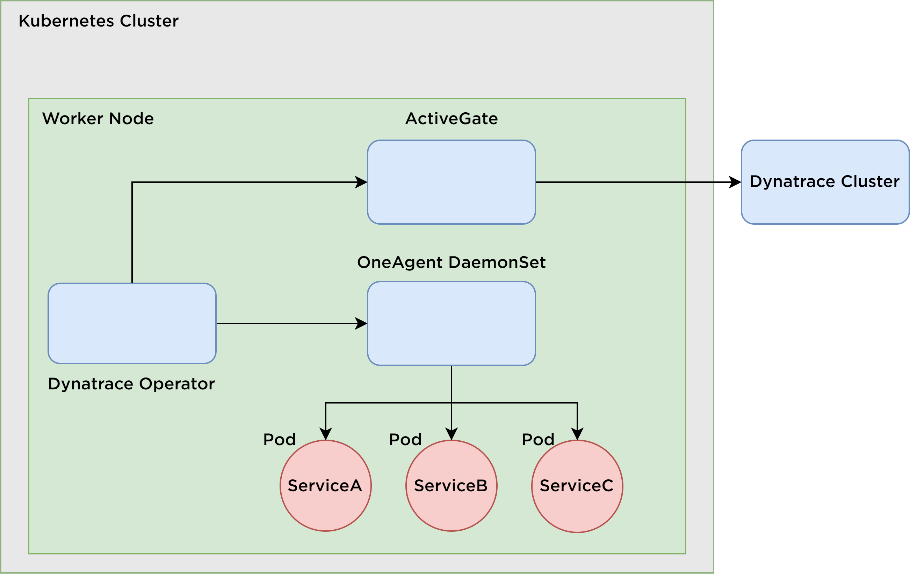

# clc3-dynatrace

## Table of Contents

1. [Introduction](#introduction)
2. [Project Idea](#project-idea)
3. [Used Technologies](#used-technologies)
4. [Milestones](#milestones)
5. [Architecture](#architecture)
6. [Kubernetes Monitoring with Dynatrace](#kubernetes-monitoring-with-dynatrace)
    1. [Dynatrace Operator](#dynatrace-operator)
    2. [Dynatrace OneAgent](#dynatrace-oneagent)
    3. [Dynatrace ActiveGate](#dynatrace-activegate)
    4. [Metrics in Dynatrace](#metrics-in-dynatrace)
    5. [Distributed tracing (PurePath-technology)](#distributed-tracing-purepath-technology)

## Project Idea
The goal is to observe a kubernetes cluster with several services running in pods (at least 3) and get metrics about their health, status and how they are communicating.
The services are implemented in Java. They throw randomly exceptions and produce delays. The Dynatrace software should observe this behavior and visualize some metrics. During the Live Demo, the services are started, some metrics from Dynatrace are produced and visualized live (if possible).

## Used Technologies
Java, Kubernetes, Dynatrace, Github

## Milestones
1. At least three simple services in JAVA are implemented
2. Kubernetes is set up
3. Dynatrace is installed and set up
4. Cluster is observed and metrics are available in dynatrace dashboard
5. Preparation for live demo is done

## Architecture

## Kubernetes Monitoring with Dynatrace
As described in the [Architecture](#architecture), Dynatrace has the components Dynatrace Operator, Active Gate, One Agent and Dynatrace Cluster. These are described in more detail below:

[Documentation Link](https://www.dynatrace.com/support/help/setup-and-configuration/setup-on-container-platforms/kubernetes/get-started-with-kubernetes-monitoring/deployment-options-k8s)

### Dynatrace Operator
The Dynatrace operator is a software component that provides automated management and deployment of Dynatrace monitoring environments within a Kubernetes cluster. It can be used to perform a variety of tasks, including the deployment and configuration of Dynatrace OneAgent and ActiveGate components.

[See here for more details](https://github.com/Dynatrace/dynatrace-operator)

### Dynatrace OneAgent
Dynatrace OneAgent is a software agent that collects and monitors performance and behavior data from hosts, applications, and containers. It provides operational and business performance metrics and is compatible with various technologies. OneAgent discovers processes and activates instrumentation for the unique application stack, as well as injecting tags for user-experience monitoring. It is comprised of several code modules and is compatible with certain platforms and versions, which can be found in the relevant documentation.

On Kubernetes, OneAgent is running on the every Node.

[See here for more details](https://www.dynatrace.com/support/help/setup-and-configuration/dynatrace-oneagent)

### Dynatrace ActiveGate
Dynatrace ActiveGate is a software component that serves as a secure proxy between Dynatrace OneAgents and Dynatrace Clusters or between Dynatrace OneAgents and other ActiveGates. It establishes Dynatrace presence in local networks and allows for the optimization of traffic volume, reduction of network complexity and cost, and increased security of sealed networks. In addition to routing data captured by OneAgents, ActiveGate can also perform monitoring tasks using APIs to query and monitor a wide range of technologies. ActiveGates can be deployed on physical or virtual hosts or as containers and come in different types (Environment ActiveGates or Cluster ActiveGates) depending on the Dynatrace deployment solution being used and the purpose for which Dynatrace is being used.

[See here for more details](https://www.dynatrace.com/support/help/setup-and-configuration/dynatrace-activegate/)

### Metrics in Dynatrace
Dynatrace provides three types of metrics: 
* built-in metrics from OneAgent (builtin prefix)
* extension metrics from OneAgent or ActiveGate (ext prefix)
* calculated metrics (calc prefix)
* custom metrics (no prefix)

This work is focused on the built-in metrics. Dynatrace offers multiple "built-in" metrics for each supported technology, which are included in the product and may be part of built-in extensions. These metrics can be accessed through OneAgent monitoring.

[Overview of Built-in metrics](https://www.dynatrace.com/support/help/how-to-use-dynatrace/metrics/built-in-metrics)

### Distributed tracing (PurePath-technology)
Another part of this work is the distributed tracing. Dynatrace PurePath is a feature that combines distributed tracing with code-level visibility, topology information, and metadata to provide detailed data granularity and fidelity. OneAgent automatically captures PurePath traces across entire transactions, covering multiple devices, operating systems, page actions, and code methods. This data enables method-level analysis, detailed error analysis, database analysis, request attributes, and multidimensional analysis.

[See here for more details](https://www.dynatrace.com/support/help/how-to-use-dynatrace/services/purepath-distributed-traces)

