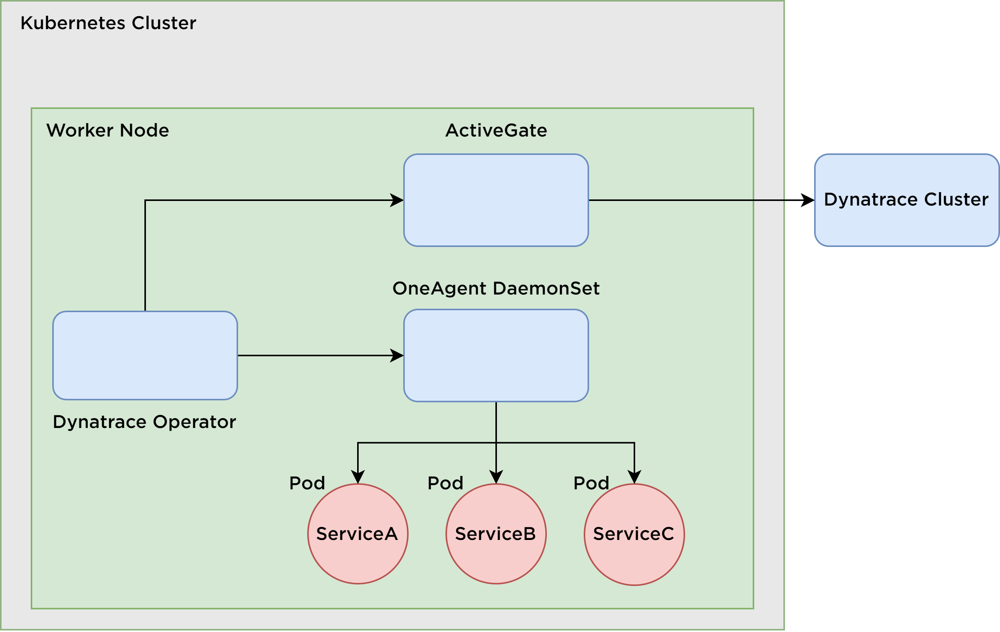
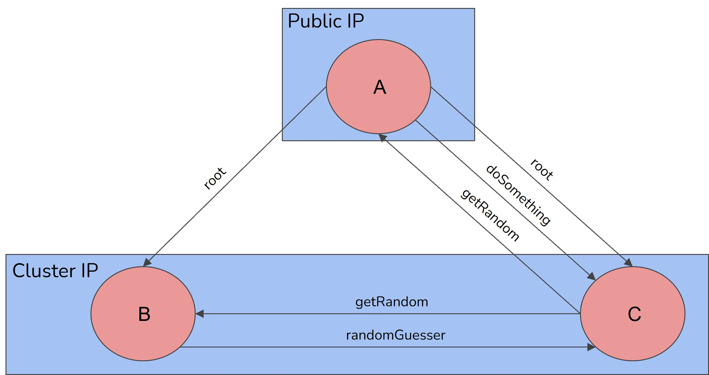
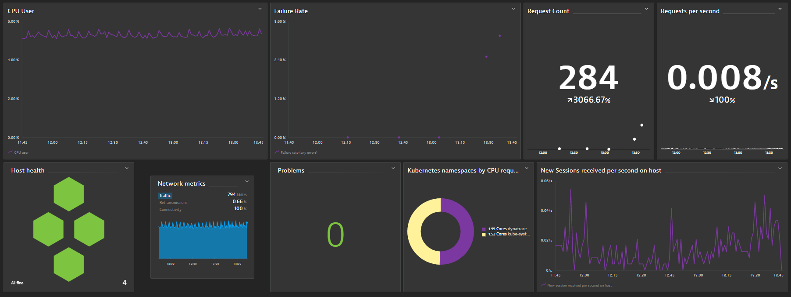
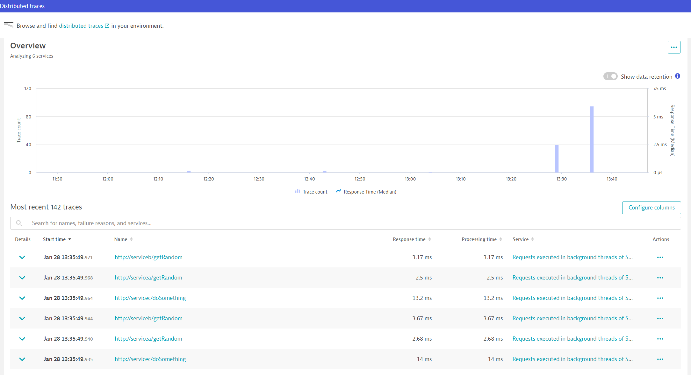
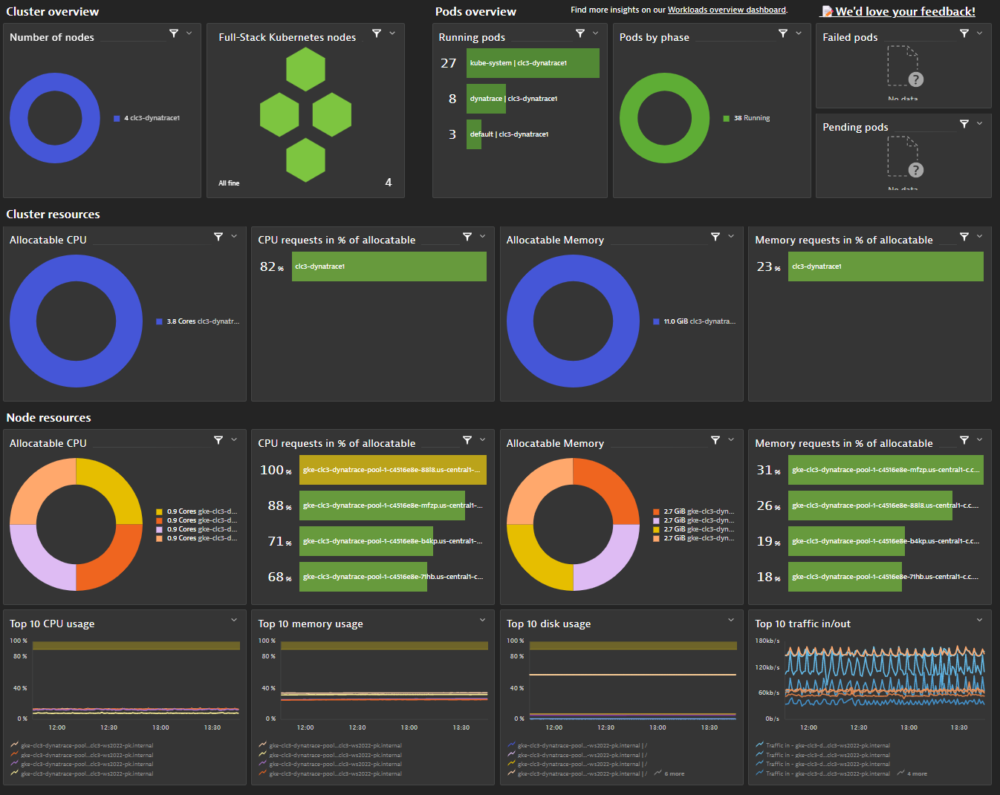

# clc3-dynatrace
## Table of Contents
- [clc3-dynatrace](#clc3-dynatrace)
  - [Table of Contents](#table-of-contents)
  - [Introduction](#introduction)
  - [Used Technologies](#used-technologies)
  - [Milestones](#milestones)
  - [Architecture](#architecture)
  - [Dynatrace Components](#dynatrace-components)
  - [Services](#services)
  - [Steps to set up Dynatrace](#steps-to-set-up-dynatrace)
    - [1. Create a Kubernetes Cluster](#1-create-a-kubernetes-cluster)
    - [2. Deploy Services in Kubernetes Cluster](#2-deploy-services-in-kubernetes-cluster)
    - [3. Set up Dynatrace](#3-set-up-dynatrace)
  - [Test - Traffic](#test---traffic)
  - [Results](#results)
    - [Dynatrace Dashboard](#dynatrace-dashboard)
    - [Distributed Tracing (PurePath)](#distributed-tracing-purepath)
    - [Kubernetes Cluster Overview](#kubernetes-cluster-overview)
  - [Lessons Learned](#lessons-learned)

## Introduction
This project aims to observe a Kubernetes cluster with several services running in pods (at least 3) and get metrics about their health, status and how they are communicating. The services are implemented in Java and throw randomly exceptions and produce delays. The Dynatrace software will observe this behavior and visualize some metrics. Another Part of this project is the distributed tracing. Dynatrace PurePath is a feature that combines distributed tracing with code-level visibility, topology information, and metadata to provide detailed data granularity and fidelity.

## Used Technologies
* Java
* Kubernetes
* Dynatrace
* Github
* Docker

## Milestones
* Implement at least three simple services in JAVA
* Set up Kubernetes on Google Cloud
* Install and set up Dynatrace
* Observe the cluster and make metrics available in the Dynatrace dashboard
* Prepare for live demo

## Architecture
Kubernetes Monitoring with Dynatrace
Dynatrace has the following components for monitoring a Kubernetes cluster:

Here you can see the architecture:



## Dynatrace Components
Dynatrace has the following components for monitoring a Kubernetes cluster:

* Dynatrace Operator
* Dynatrace OneAgent
* Dynatrace ActiveGate
* Dynatrace Cluster

The components are described in more detail in the [Proposal](Proposal.md).

## Services
The services are implemented in Java. Service A is the main service and calls the other services. Service B and C are called by Service A. The services are doing different things such as throwing exceptions, producing delays, producing random numbers and so on.

Here you can see the architecture of the services:


## Steps to set up Dynatrace

* Set up Kubernetes Cluster
* Deploy Services in Kubernetes Cluster
* Set up Dynatrace


### 1. Create a Kubernetes Cluster
Follow the [Quickstart](https://cloud.google.com/kubernetes-engine/docs/quickstart) or follow the Steps provided by agrimmer on [Github](https://github.com/clc3-CloudComputing/ws22/tree/main/3%20Kubernetes/exercise%203.1#google-kubernetes-engine-gke) to create a Kubernetes cluster on Google Cloud.

### 2. Deploy Services in Kubernetes Cluster
* Clone the repository
* apply the following commands to deploy the services in the cluster in each folder (ServiceA, ServiceB, ServiceC)
```bash
kubectl apply -f deployment.yaml
kubectl apply -f service.yaml
```
* Check if the services are running
```bash
kubectl get pods
```
* Check if the services are reachable and get the IP address
```bash
kubectl get services
```
* Describe main service ServiceA
```bash
kubectl descrive service servicea
```
### 3. Set up Dynatrace
* Create a Dynatrace account
* Deploy Dynatrace on Kubernetes (follow the [Quickstart](hhttps://www.dynatrace.com/support/help/setup-and-configuration/setup-on-container-platforms/kubernetes/get-started-with-kubernetes-monitoring#expand--instructions-for-automated-mode--2))
* Important Note: Enable **volumen storage** when using Google Cloud
* After following the Steps, create and download the dynakube.yaml file
* Apply the following commands on your cluster
```console
kubectl create namespace dynatrace

kubectl apply -f https://github.com/Dynatrace/dynatrace-operator/releases/download/v0.10.1/kubernetes.yaml

kubectl -n dynatrace wait pod --for=condition=ready --selector=app.kubernetes.io/name=dynatrace-operator,app.kubernetes.io/component=webhook --timeout=300s

kubectl apply -f dynakube.yaml

```
* check deployment status on Dynatrace UI
  * Active Gate should be installed
  * OneAgent should be installed

* check deployment status on Kubernetes
```console
kubectl get pods -n dynatrace

kubectl get deployments -n dynatrace

kubectl -n dynatrace describe pod --selector=app.kubernetes.io/name=dynatrace-operator,app.kubernetes.io/component=webhook
```

Now you can see the metrics in the Dynatrace UI and the Kubernetes Cluster is monitored.

## Test - Traffic
In the test folder you can find a script to produce traffic on the services. The script calls the main service X times. The script is implemented in Python.

## Results
Below you can see some screenshots of the results in the Dynatrace UI.
### Dynatrace Dashboard

### Distributed Tracing (PurePath)

### Kubernetes Cluster Overview


## Lessons Learned
* Docker hub is a powerful tool for quickly deploying new versions. 
* Dynatrace has certain requirements for monitoring, such as a minimum number of nodes
* Running a Kubernetes cluster on Google Cloud is very expensive
* Running a Kubernetes cluster also requires maybe certain requirements in configuration
* Dynatrace ist sehr mächtig und bietet viele Möglichkeiten
* Dynatrace is very powerful and offers many capabilities


